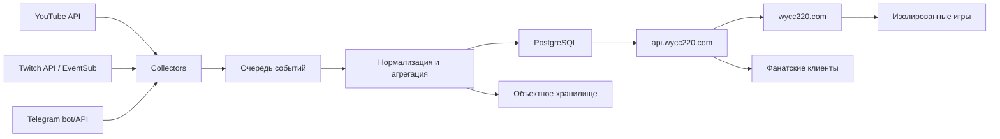

# Архитектура платформы

Имя документа соответствует принятому правилу `segment.segment.ext`.

## Контекст

Платформа объединяет метаданные видео и стримов, каталог фанатских работ, публичное API и агрегированную активность на внешних площадках. Главная архитектурная цель — позволить многим людям делать независимые части, не расширяя круг доступа к секретам и production.

## Компоненты

### `apps/web`

Публичный интерфейс. Не содержит приватных ключей и не обращается к базе напрямую. Получает данные через публичный или внутренний API.

### `apps/api`

Версионируемый API `/v1`. Проверяет входные данные, применяет rate limit, возвращает стабильные DTO из `packages/contracts`. Административные операции отделены от публичного API и требуют аудита.

### `apps/collector`

Набор адаптеров внешних платформ. Каждый адаптер использует отдельный сервисный аккаунт с минимальными правами и пишет нормализованные события в очередь. Сбой одной площадки не останавливает остальные.

### `packages/contracts`

Единственный источник схем публичного API, событий и манифестов фанатских проектов. Несовместимые изменения выпускаются только новой версией API.

## Домены

- **Media Catalog** — каналы, видео, стримы, игры/категории, теги и ссылки на оригинал.
- **Community Projects** — манифесты игр и приложений, авторство, версии, модерация.
- **Gallery** — метаданные работ, лицензия автора, модерация и безопасные производные изображения.
- **Activity** — платформенные идентификаторы, события и агрегированные очки.
- **Identity** — добровольная привязка внешних аккаунтов; не строится на догадках.
- **Moderation** — статусы, причины решений, апелляции и журнал действий.

Домены сначала остаются модулями одного backend и одной PostgreSQL. Разделение на микросервисы допускается только после измеренной необходимости; секреты и права уже разделяются по процессам.

## Фанатские игры

Каталог принимает декларативный манифест. По умолчанию игра размещается на отдельном origin (`*.games.wycc220.com`) или открывается как внешняя ссылка. Она не имеет доступа к cookies основного сайта. Встраивание требует sandboxed iframe, строгого CSP и явного списка возможностей. Серверный код игры не запускается в инфраструктуре платформы без отдельного security review.

## Поток данных активности

1. Адаптер получает разрешённое публичное событие по официальному API.
2. Сохраняется источник, внешний event id и минимальный набор полей для дедупликации.
3. Асинхронный обработчик начисляет очки по версионируемым прозрачным правилам.
4. Публичный API отдаёт агрегаты, а не тексты сообщений и сырые журналы.
5. Удаление источником, opt-out или модерация пересчитывают агрегат.

Точные правила рейтинга должны пройти отдельное обсуждение: они влияют на поведение аудитории и защиту от накрутки.

## Развёртывание

Каждое приложение собирается независимо. PR из fork не получает секретов и создаёт только безопасный preview. Production разворачивается исключительно из защищённой `main` с OIDC и отдельным approval environment; долгоживущие облачные ключи в GitHub не хранятся.
